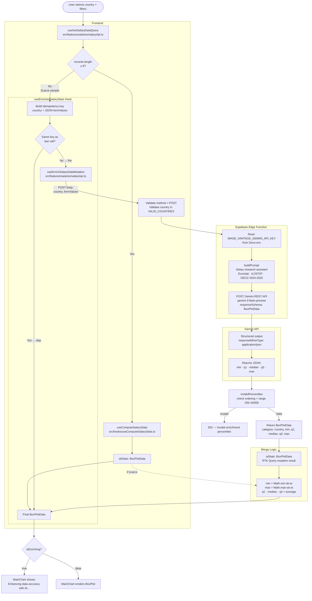

# Gemini AI Enrichment — Salary Data Fallback

When `get-salary-data` returns fewer than 8 records for a given country + filter combination,
the app silently calls Gemini to produce a realistic `BoxPlotData` estimate based on public
salary research (Eurostat, ILOSTAT, OECD 2024-2025). The result is merged with whatever
Supabase data exists and passed to `MainChart` as a single unified dataset.

---

## Full Flow Diagram



---

## Threshold

`SCARCE_SAMPLE_THRESHOLD = 8` — defined in `src/hooks/useEnrichedSalaryStats.ts`.

If `records.length < 8`, the Gemini fallback fires. Otherwise Supabase stats are used as-is.

---

## Merge Strategy

| Field | Formula | Rationale |
|---|---|---|
| `min` | `Math.min(sb, ai)` | Absolute lower bound across both sources |
| `q1` | `(sb + ai) / 2` | Simple average of the central zone |
| `median` | `(sb + ai) / 2` | Idem |
| `q3` | `(sb + ai) / 2` | Idem |
| `max` | `Math.max(sb, ai)` | Absolute upper bound across both sources |
| `category` | From Supabase (primary) | Preserve visual identity |
| `color` | From Supabase (primary) | Idem |

If one source is `null`, the other is returned unchanged (graceful degradation).

---

## Infinite Loop Guard

RTK Query recreates `enrich` and `reset` function references on every render.
Including them in `useEffect` deps causes an infinite re-render loop.

The fix (in `useEnrichedSalaryStats.ts`):

```ts
// 1. Store latest function refs — stable pointers, never in deps
const enrichRef = useRef(enrich);
const resetRef  = useRef(reset);
useEffect(() => { enrichRef.current = enrich; resetRef.current = reset; });

// 2. Idempotency guard — only call Gemini when country|formValues changes
const lastEnrichKeyRef = useRef<string | null>(null);
const key = `${country}|${formValuesKey}`;
if (lastEnrichKeyRef.current === key) return;
lastEnrichKeyRef.current = key;
enrichRef.current({ country, formValues });

// 3. Primitive deps only — records?.length (number), not records (array ref)
}, [country, records_length, formValuesKey]);
```

---

## Key Files

| File | Role |
|---|---|
| `supabase/functions/enrich-salary-data/index.ts` | Deno edge function — Gemini proxy + validation |
| `src/hooks/useEnrichedSalaryStats.ts` | React hook — orchestrates fallback + merge |
| `src/features/salaries/salaryApi.ts` | RTK Query `enrichSalaryData` mutation endpoint |
| `src/hooks/useComputeSalaryStats.ts` | Computes BoxPlotData from raw Supabase records |
| `src/features/salaries/salaryUtils.ts` | `mergeBoxPlots` utility |
| `src/components/charts/MainChart/index.tsx` | Renders chart; shows AI enriching message |

---

## Gemini Configuration

| Parameter | Value |
|---|---|
| Model | `gemini-3-flash-preview` |
| Response format | `responseMimeType: "application/json"` + `responseSchema` |
| Endpoint | `https://generativelanguage.googleapis.com/v1beta/models/...` |
| Auth | `WAGE_VANTAGE_GEMINI_API_KEY` — Supabase project secret, never in frontend |
| Secret injection | `Deno.env.get('WAGE_VANTAGE_GEMINI_API_KEY')` at runtime |

---

## UI States

| State | Message shown |
|---|---|
| Supabase fetching | `Loading chart...` |
| Gemini enriching | `Enhancing data accuracy with AI...` |
| No data (both failed) | `No data available` |
| Ready | BoxPlot chart renders |

---

## Error Handling

| Scenario | HTTP code | Behavior |
|---|---|---|
| Invalid / missing country | 400 | Frontend shows no chart (sbStats only) |
| `WAGE_VANTAGE_GEMINI_API_KEY` missing | 500 | RTK mutation fails, sbStats used as fallback |
| Gemini API error | 502 | Idem |
| Gemini returns malformed JSON | 502 | Idem |
| Percentiles fail validation | 502 | Idem |

All failure paths degrade gracefully: if `aiStats` is undefined, `mergeBoxPlots` returns `sbStats` (or `null` if Supabase was also empty).
