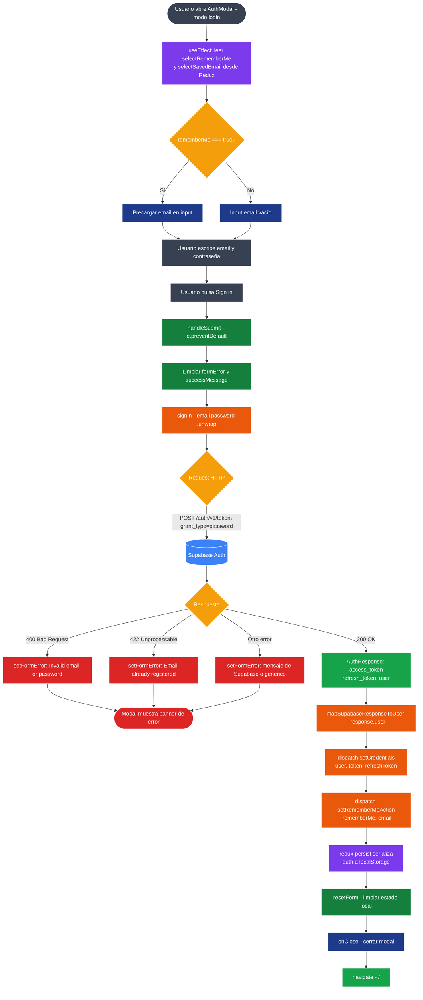
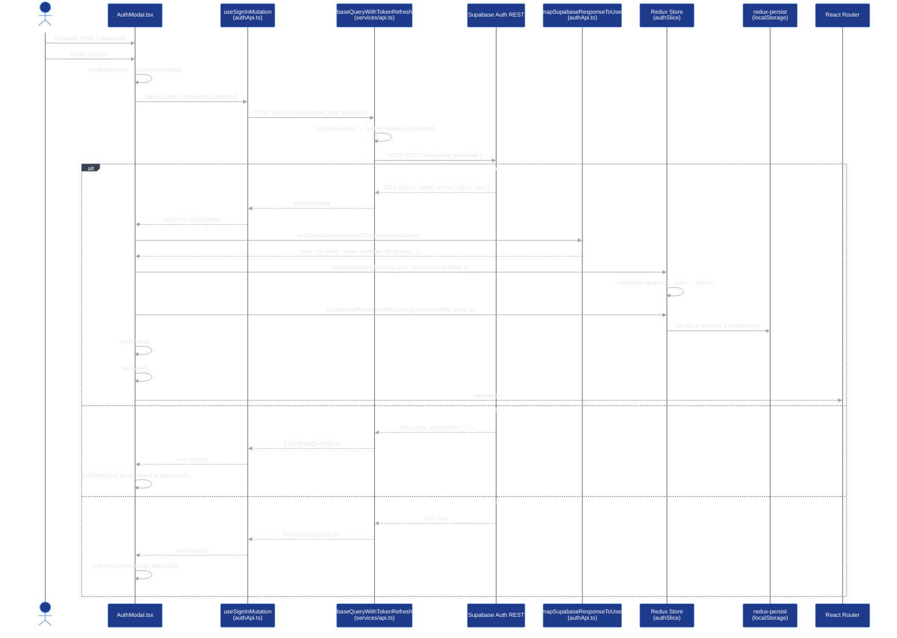
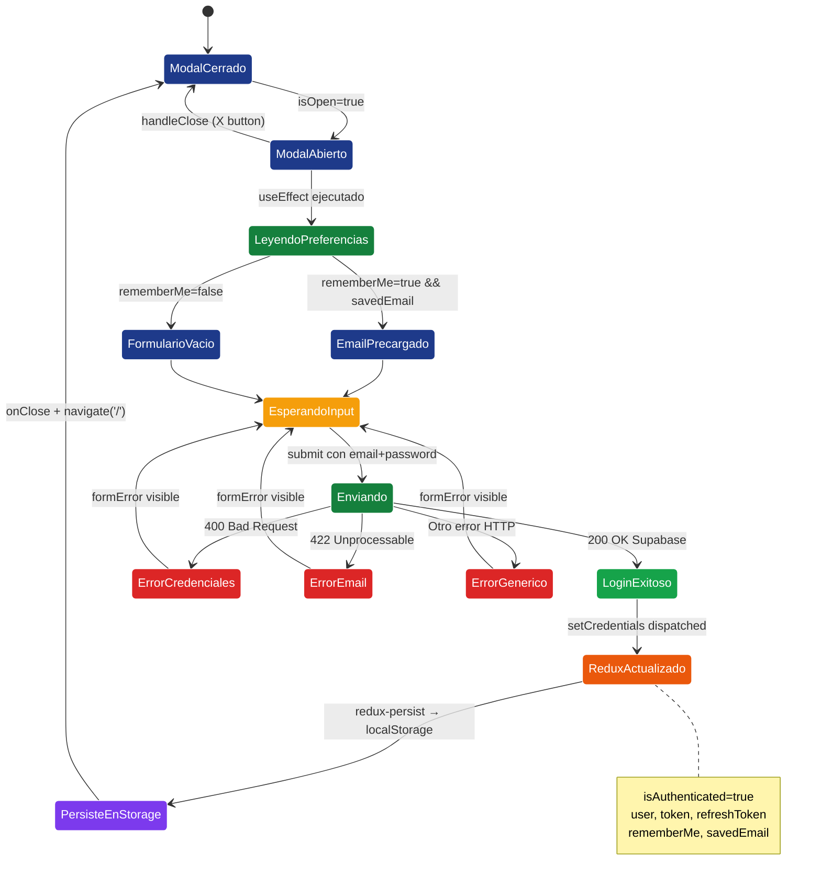
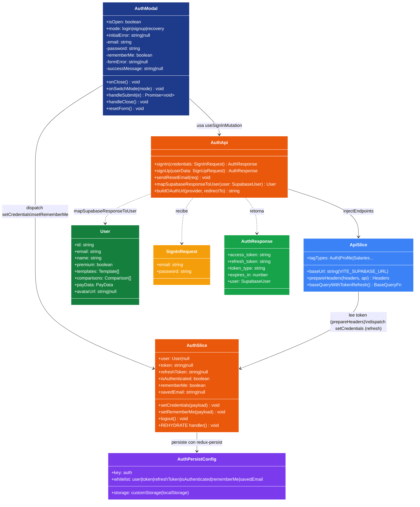
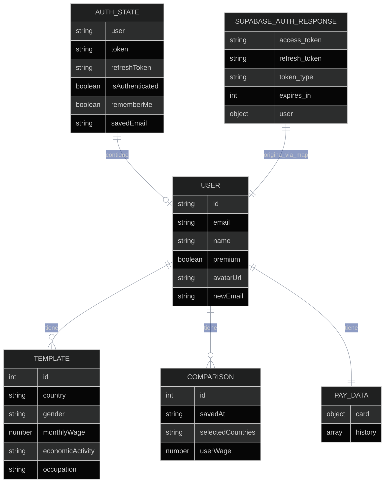
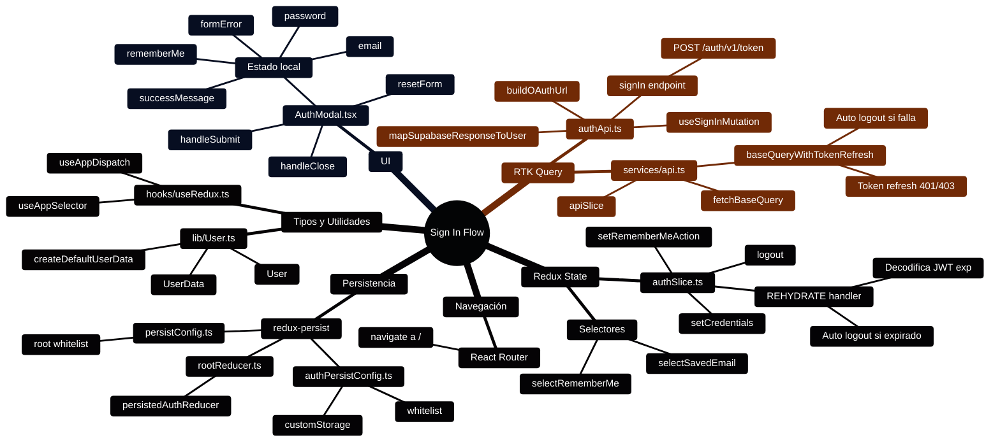

# Sign In Flow — Diagramas

## Diagrama de Flujo

```mermaid
graph TD
    A([Usuario abre AuthModal - modo login]) --> B[useEffect: leer selectRememberMe\ny selectSavedEmail desde Redux]
    B --> C{rememberMe === true?}
    C -- Sí --> D[Precargar email en input]
    C -- No --> E[Input email vacío]
    D --> F[Usuario escribe email y contraseña]
    E --> F
    F --> G[Usuario pulsa Sign in]
    G --> H[handleSubmit - e.preventDefault]
    H --> I[Limpiar formError y successMessage]
    I --> J[signIn - email password .unwrap]
    J --> K{Request HTTP}
    K -- POST /auth/v1/token?grant_type=password --> L[(Supabase Auth)]
    L --> M{Respuesta}
    M -- 200 OK --> N[AuthResponse: access_token\nrefresh_token, user]
    M -- 400 Bad Request --> O[setFormError: Invalid email or password]
    M -- 422 Unprocessable --> P[setFormError: Email already registered]
    M -- Otro error --> Q[setFormError: mensaje de Supabase o genérico]
    O --> R([Modal muestra banner de error])
    P --> R
    Q --> R
    N --> S[mapSupabaseResponseToUser - response.user]
    S --> T[dispatch setCredentials\n user, token, refreshToken]
    T --> U[dispatch setRememberMeAction\n rememberMe, email]
    U --> V[redux-persist serializa\nauth a localStorage]
    V --> W[resetForm - limpiar estado local]
    W --> X[onClose - cerrar modal]
    X --> Y[navigate - /]

    style A fill:#374151,stroke:#fff,color:#fff
    style B fill:#7c3aed,stroke:#fff,color:#fff
    style C fill:#f59e0b,stroke:#fff,color:#fff
    style D fill:#1e3a8a,stroke:#fff,color:#fff
    style E fill:#1e3a8a,stroke:#fff,color:#fff
    style F fill:#374151,stroke:#fff,color:#fff
    style G fill:#374151,stroke:#fff,color:#fff
    style H fill:#15803d,stroke:#fff,color:#fff
    style I fill:#15803d,stroke:#fff,color:#fff
    style J fill:#ea580c,stroke:#fff,color:#fff
    style K fill:#f59e0b,stroke:#fff,color:#fff
    style L fill:#3b82f6,stroke:#fff,color:#fff
    style M fill:#f59e0b,stroke:#fff,color:#fff
    style N fill:#16a34a,stroke:#fff,color:#fff
    style O fill:#dc2626,stroke:#fff,color:#fff
    style P fill:#dc2626,stroke:#fff,color:#fff
    style Q fill:#dc2626,stroke:#fff,color:#fff
    style R fill:#dc2626,stroke:#fff,color:#fff
    style S fill:#ea580c,stroke:#fff,color:#fff
    style T fill:#ea580c,stroke:#fff,color:#fff
    style U fill:#ea580c,stroke:#fff,color:#fff
    style V fill:#7c3aed,stroke:#fff,color:#fff
    style W fill:#15803d,stroke:#fff,color:#fff
    style X fill:#1e3a8a,stroke:#fff,color:#fff
    style Y fill:#16a34a,stroke:#fff,color:#fff
```

## Diagrama de Secuencia

```mermaid
%%{init: {'theme':'dark', 'themeVariables': {
  'actorBkg':'#1e3a8a',
  'actorBorder':'#60a5fa',
  'actorTextColor':'#ffffff',
  'actorLineColor':'#6b7280',
  'signalColor':'#9ca3af',
  'signalTextColor':'#e5e7eb',
  'labelBoxBkgColor':'#374151',
  'labelBoxBorderColor':'#6b7280',
  'labelTextColor':'#ffffff',
  'loopTextColor':'#ffffff',
  'noteBkgColor':'#78350f',
  'noteTextColor':'#fef3c7',
  'noteBorderColor':'#f59e0b',
  'activationBkgColor':'#1e3a5f',
  'activationBorderColor':'#3b82f6'
}}}%%
sequenceDiagram
    actor User as Usuario
    participant Modal as AuthModal.tsx
    participant RTK as useSignInMutation<br/>(authApi.ts)
    participant BQ as baseQueryWithTokenRefresh<br/>(services/api.ts)
    participant SB as Supabase Auth REST
    participant Mapper as mapSupabaseResponseToUser<br/>(authApi.ts)
    participant Store as Redux Store<br/>(authSlice)
    participant Persist as redux-persist<br/>(localStorage)
    participant Router as React Router

    User->>Modal: Introduce email + password
    User->>Modal: Pulsa "Sign in"
    Modal->>Modal: handleSubmit() → e.preventDefault()
    Modal->>RTK: signIn({ email, password }).unwrap()
    RTK->>BQ: POST /auth/v1/token?grant_type=password
    BQ->>BQ: prepareHeaders → apikey header (sin Bearer)
    BQ->>SB: HTTP POST con { email, password }

    alt Credenciales válidas
        SB-->>BQ: 200 { access_token, refresh_token, user }
        BQ-->>RTK: AuthResponse
        RTK-->>Modal: response (unwrapped)
        Modal->>Mapper: mapSupabaseResponseToUser(response.user)
        Mapper-->>Modal: User { id, email, name, premium, templates... }
        Modal->>Store: dispatch(setCredentials({ user, token, refreshToken }))
        Store->>Store: isAuthenticated=true, user=..., token=...
        Modal->>Store: dispatch(setRememberMeAction({ rememberMe, email }))
        Store->>Persist: Serializar whitelist a localStorage
        Modal->>Modal: resetForm()
        Modal->>Modal: onClose()
        Modal->>Router: navigate('/')
    else Credenciales inválidas (400)
        SB-->>BQ: 400 { error_description: "..." }
        BQ-->>RTK: FetchBaseQueryError
        RTK-->>Modal: error (catch)
        Modal->>Modal: setFormError("Invalid email or password")
    else Email no encontrado / error (422, 5xx)
        SB-->>BQ: 422 / 5xx
        BQ-->>RTK: FetchBaseQueryError
        RTK-->>Modal: error (catch)
        Modal->>Modal: setFormError(mensaje apropiado)
    end
```

## Diagrama de Estados

```mermaid
stateDiagram-v2
    [*] --> ModalCerrado

    ModalCerrado --> ModalAbierto: isOpen=true
    ModalAbierto --> LeyendoPreferencias: useEffect ejecutado

    LeyendoPreferencias --> EmailPrecargado: rememberMe=true && savedEmail
    LeyendoPreferencias --> FormularioVacio: rememberMe=false

    EmailPrecargado --> EsperandoInput
    FormularioVacio --> EsperandoInput

    EsperandoInput --> Enviando: submit con email+password

    Enviando --> LoginExitoso: 200 OK Supabase
    Enviando --> ErrorCredenciales: 400 Bad Request
    Enviando --> ErrorEmail: 422 Unprocessable
    Enviando --> ErrorGenerico: Otro error HTTP

    LoginExitoso --> ReduxActualizado: setCredentials dispatched
    ReduxActualizado --> PersisteEnStorage: redux-persist → localStorage
    PersisteEnStorage --> ModalCerrado: onClose + navigate('/')

    ErrorCredenciales --> EsperandoInput: formError visible
    ErrorEmail --> EsperandoInput: formError visible
    ErrorGenerico --> EsperandoInput: formError visible

    ModalAbierto --> ModalCerrado: handleClose (X button)

    note right of ReduxActualizado
        isAuthenticated=true
        user, token, refreshToken
        rememberMe, savedEmail
    end note

    classDef uiState fill:#1e3a8a,stroke:#fff,color:#fff
    classDef processState fill:#15803d,stroke:#fff,color:#fff
    classDef storageState fill:#7c3aed,stroke:#fff,color:#fff
    classDef errorState fill:#dc2626,stroke:#fff,color:#fff
    classDef successState fill:#16a34a,stroke:#fff,color:#fff
    classDef reduxState fill:#ea580c,stroke:#fff,color:#fff
    classDef waitingState fill:#f59e0b,stroke:#fff,color:#fff

    class ModalCerrado,ModalAbierto uiState
    class LeyendoPreferencias,Enviando processState
    class EmailPrecargado,FormularioVacio uiState
    class EsperandoInput waitingState
    class LoginExitoso successState
    class ErrorCredenciales,ErrorEmail,ErrorGenerico errorState
    class ReduxActualizado reduxState
    class PersisteEnStorage storageState
```

## Diagrama de Clases

```mermaid
classDiagram
    class AuthModal {
        +isOpen: boolean
        +onClose() void
        +mode: login|signup|recovery
        +onSwitchMode(mode) void
        +initialError: string|null
        -email: string
        -password: string
        -rememberMe: boolean
        -formError: string|null
        -successMessage: string|null
        +handleSubmit(e) Promise~void~
        +handleClose() void
        +resetForm() void
    }

    class AuthApi {
        +signIn(credentials: SignInRequest) AuthResponse
        +signUp(userData: SignUpRequest) AuthResponse
        +sendResetEmail(req) void
        +mapSupabaseResponseToUser(user: SupabaseUser) User
        +buildOAuthUrl(provider, redirectTo) string
    }

    class ApiSlice {
        +baseUrl: string (VITE_SUPABASE_URL)
        +prepareHeaders(headers, api) Headers
        +baseQueryWithTokenRefresh() BaseQueryFn
        +tagTypes: Auth|Profile|Salaries...
    }

    class AuthSlice {
        +user: User|null
        +token: string|null
        +refreshToken: string|null
        +isAuthenticated: boolean
        +rememberMe: boolean
        +savedEmail: string|null
        +setCredentials(payload) void
        +setRememberMe(payload) void
        +logout() void
        +REHYDRATE handler() void
    }

    class AuthPersistConfig {
        +key: auth
        +storage: customStorage (localStorage)
        +whitelist: user|token|refreshToken|isAuthenticated|rememberMe|savedEmail
    }

    class User {
        +id: string
        +email: string
        +name: string
        +premium: boolean
        +templates: Template[]
        +comparisons: Comparison[]
        +payData: PayData
        +avatarUrl: string|null
    }

    class SignInRequest {
        +email: string
        +password: string
    }

    class AuthResponse {
        +access_token: string
        +refresh_token: string
        +token_type: string
        +expires_in: number
        +user: SupabaseUser
    }

    AuthModal --> AuthApi : usa useSignInMutation
    AuthModal --> AuthSlice : dispatch setCredentials\nsetRememberMe
    AuthApi --> ApiSlice : injectEndpoints
    ApiSlice --> AuthSlice : lee token (prepareHeaders)\ndispatch setCredentials (refresh)
    AuthSlice --> AuthPersistConfig : persiste con redux-persist
    AuthApi ..> AuthResponse : retorna
    AuthApi ..> User : mapSupabaseResponseToUser
    AuthApi ..> SignInRequest : recibe

    style AuthModal fill:#1e3a8a,stroke:#fff,color:#fff
    style AuthApi fill:#ea580c,stroke:#fff,color:#fff
    style ApiSlice fill:#3b82f6,stroke:#fff,color:#fff
    style AuthSlice fill:#ea580c,stroke:#fff,color:#fff
    style AuthPersistConfig fill:#7c3aed,stroke:#fff,color:#fff
    style User fill:#15803d,stroke:#fff,color:#fff
    style SignInRequest fill:#f59e0b,stroke:#fff,color:#fff
    style AuthResponse fill:#16a34a,stroke:#fff,color:#fff
```

## Diagrama de Entidad-Relación

```mermaid
%%{init: {'theme':'dark', 'themeVariables': {
  'primaryColor':'#1e3a8a',
  'primaryTextColor':'#ffffff',
  'primaryBorderColor':'#60a5fa',
  'lineColor':'#9ca3af',
  'secondaryColor':'#374151',
  'tertiaryColor':'#1e3a8a',
  'edgeLabelBackground':'#1f2937',
  'attributeBackgroundColorEven':'#1f2937',
  'attributeBackgroundColorOdd':'#111827'
}}}%%
erDiagram
    AUTH_STATE {
        string user
        string token
        string refreshToken
        boolean isAuthenticated
        boolean rememberMe
        string savedEmail
    }

    USER {
        string id
        string email
        string name
        boolean premium
        string avatarUrl
        string newEmail
    }

    TEMPLATE {
        int id
        string country
        string gender
        number monthlyWage
        string economicActivity
        string occupation
    }

    COMPARISON {
        int id
        string savedAt
        string selectedCountries
        number userWage
    }

    PAY_DATA {
        object card
        array history
    }

    SUPABASE_AUTH_RESPONSE {
        string access_token
        string refresh_token
        string token_type
        int expires_in
        object user
    }

    AUTH_STATE ||--o| USER : contiene
    USER ||--o{ TEMPLATE : tiene
    USER ||--o{ COMPARISON : tiene
    USER ||--|| PAY_DATA : tiene
    SUPABASE_AUTH_RESPONSE ||--|| USER : origina_via_map
```

## Mapa Mental

```mermaid
%%{init: {'theme':'base', 'themeVariables': {
  'primaryColor':'#374151',
  'primaryTextColor':'#fff',
  'primaryBorderColor':'#fff',
  'secondaryColor':'#1e3a8a',
  'tertiaryColor':'#ea580c',
  'lineColor':'#6b7280'
}}}%%
mindmap
  root((Sign In Flow))
    UI
      AuthModal.tsx
        handleSubmit
        handleClose
        resetForm
        Estado local
          email
          password
          rememberMe
          formError
          successMessage
    RTK Query
      authApi.ts
        useSignInMutation
        signIn endpoint
          POST /auth/v1/token
        mapSupabaseResponseToUser
        buildOAuthUrl
      services/api.ts
        apiSlice
        fetchBaseQuery
        baseQueryWithTokenRefresh
          Token refresh 401/403
          Auto logout si falla
    Redux State
      authSlice.ts
        setCredentials
        setRememberMeAction
        logout
        REHYDRATE handler
          Decodifica JWT exp
          Auto logout si expirado
      Selectores
        selectRememberMe
        selectSavedEmail
    Persistencia
      redux-persist
        authPersistConfig.ts
          whitelist
          customStorage
        persistConfig.ts
          root whitelist
        rootReducer.ts
          persistedAuthReducer
    Navegación
      React Router
        navigate a /
    Tipos y Utilidades
      lib/User.ts
        UserData
        User
        createDefaultUserData
      hooks/useRedux.ts
        useAppDispatch
        useAppSelector
```
