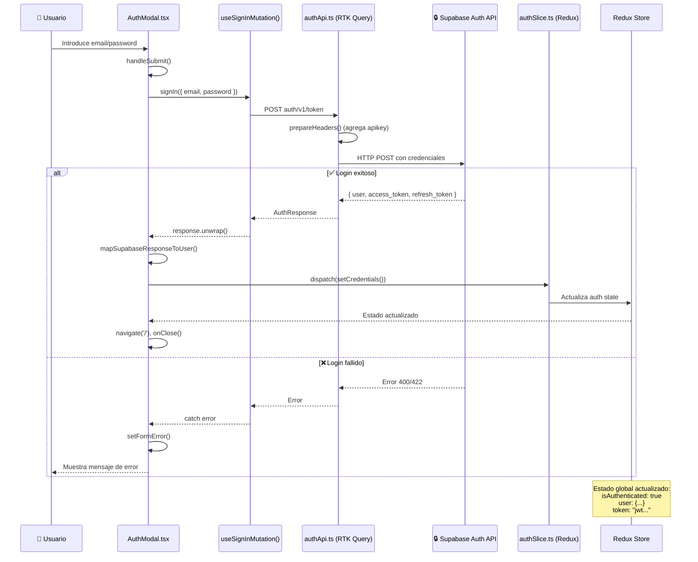

# SignIn Feature - Sequence Diagram

Este diagrama muestra la secuencia temporal de interacciones entre componentes durante el proceso de login.

## Flujo de Autenticación

## Descripción del Flujo

### Paso 1: Input del Usuario

El usuario introduce sus credenciales (email y password) en el formulario de `AuthModal.tsx`.

### Paso 2: Submit y Ejecución de Mutación

Al hacer submit, se ejecuta el hook `useSignInMutation()` con las credenciales.

### Paso 3: Configuración de Request

RTK Query configura la petición HTTP con el endpoint `/auth/v1/token` y agrega headers automáticamente (apikey).

### Paso 4: Petición a Supabase

Se envía la petición HTTP POST a Supabase Auth API.

### Paso 5: Bifurcación Éxito/Error

#### ✅ Caso exitoso:

1. Supabase retorna `{ user, access_token, refresh_token }`
2. RTK Query retorna la respuesta
3. `.unwrap()` extrae los datos
4. `mapSupabaseResponseToUser()` transforma la estructura
5. `dispatch(setCredentials())` actualiza el estado global
6. Redux Store notifica a todos los componentes suscritos
7. Modal cierra y navega a `/`

#### ❌ Caso de error:

1. Supabase retorna error 400/422
2. RTK Query lanza el error
3. El bloque `catch` captura el error
4. `setFormError()` muestra mensaje al usuario
5. El usuario puede reintentar

## Archivos Relacionados

- [AuthModal.tsx](../../../src/components/ui/modals/AuthModal.tsx)
- [authApi.ts](../../../src/features/auth/authApi.ts)
- [authSlice.ts](../../../src/features/auth/authSlice.ts)
- [api.ts](../../../src/services/api.ts)
