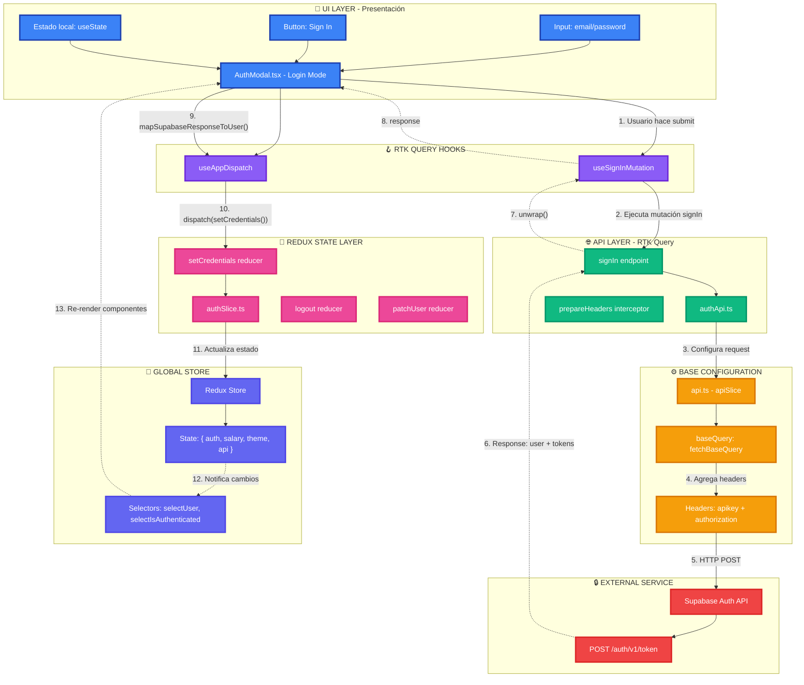

# SignIn Feature - Architectural Wireframe

Este diagrama muestra la arquitectura en capas del sistema de autenticación y cómo fluyen los datos a través de cada capa.

## Arquitectura por Capas

## Capas de la Arquitectura

### 🎨 Layer 1: UI - Presentación (Azul)

**Componentes:** `AuthModal.tsx`, inputs, botones

- **Responsabilidad:** Capturar input del usuario
- **Estado:** Local con `useState` para email/password
- **Sin lógica de negocio:** Solo presenta UI y delega acciones

### 🪝 Layer 2: Hooks (Púrpura)

**Hooks:** `useSignInMutation`, `useAppDispatch`

- **Responsabilidad:** Conectar UI con lógica de datos
- **Auto-generados:** RTK Query genera los mutation hooks
- **Tipado:** Proveen tipado completo TypeScript

### 🌐 Layer 3: API Layer (Verde)

**Archivos:** `authApi.ts`, endpoints

- **Responsabilidad:** Definir operaciones de API
- **Endpoints:** `signIn` mutation con configuración
- **Cache:** Maneja invalidación de tags automáticamente

### ⚙️ Layer 4: Base Configuration (Naranja)

**Archivos:** `api.ts`, `baseQuery`

- **Responsabilidad:** Configuración global de RTK Query
- **Headers:** Intercepta todas las peticiones para agregar headers
- **Token injection:** Agrega automáticamente el token de autenticación

### 🔒 Layer 5: External Services (Rojo)

**Servicio:** Supabase Auth API

- **Endpoint:** `POST /auth/v1/token?grant_type=password`
- **Autenticación:** Valida credenciales y genera tokens
- **Response:** `{ user, access_token, refresh_token }`

### 💾 Layer 6: Redux State (Rosa)

**Archivos:** `authSlice.ts`, reducers

- **Responsabilidad:** Gestionar estado de autenticación
- **Reducers:** `setCredentials`, `logout`, `patchUser`
- **Inmutabilidad:** Redux Toolkit usa Immer internamente

### 🏪 Layer 7: Global Store (Índigo)

**Store:** Redux Store

- **Estado global:** `{ auth, salary, theme, api }`
- **Selectores:** `selectUser`, `selectIsAuthenticated`
- **Re-render:** Notifica automáticamente a componentes suscritos

## Flujo de Datos (13 pasos)

1. **UI → Hooks:** Usuario hace submit
2. **Hooks → API:** Ejecuta mutación `signIn`
3. **API → Base:** Configura request HTTP
4. **Base → Headers:** Agrega `apikey` y `authorization`
5. **Base → External:** Envía HTTP POST a Supabase
6. **External → API:** Response con user + tokens (línea punteada)
7. **API → Hooks:** `.unwrap()` extrae datos
8. **Hooks → UI:** Response llega al modal
9. **UI → Hooks:** `mapSupabaseResponseToUser()` transforma datos
10. **Hooks → Redux:** `dispatch(setCredentials())`
11. **Redux → Store:** Actualiza estado global
12. **Store → Selectores:** Notifica cambios
13. **Selectores → UI:** Re-render de componentes

## Separación de Responsabilidades

✅ **UI:** Solo presenta y captura input  
✅ **Hooks:** Conectan UI con datos  
✅ **API:** Define operaciones de red  
✅ **Base:** Configuración global y headers  
✅ **External:** Servicio de autenticación  
✅ **Redux:** Estado global inmutable  
✅ **Store:** Fuente única de verdad

## Archivos Relacionados

- [AuthModal.tsx](../../../src/components/ui/modals/AuthModal.tsx)
- [authApi.ts](../../../src/features/auth/authApi.ts)
- [authSlice.ts](../../../src/features/auth/authSlice.ts)
- [api.ts](../../../src/services/api.ts)
- [useRedux.ts](../../../src/hooks/useRedux.ts)
