# SignIn Feature - Complete Data Flow

Este diagrama muestra el flujo completo de datos desde el input del usuario hasta la actualización del estado global, incluyendo el manejo de errores.

## Flujo de Datos Paso a Paso

```mermaid
flowchart LR
    START([👤 Usuario ingresa credenciales])

    START --> FORM[📝 AuthModal Form<br/>Login Mode<br/>email + password]

    FORM --> SUBMIT[Submit Login]

    SUBMIT --> HOOK1[🪝 useSignInMutation]

    HOOK1 --> API1[🌐 authApi.signIn<br/>POST /auth/v1/token]

    API1 --> PREPARE[⚙️ prepareHeaders<br/>+ apikey]

    PREPARE --> HTTP[📡 HTTP Request]

    HTTP --> SUPA[🔒 Supabase Auth API]

    SUPA --> CHECK{Credenciales<br/>válidas?}

    CHECK -->|✅ Éxito| RES_OK[📦 Response<br/>user + access_token<br/>+ refresh_token]
    CHECK -->|❌ Error| RES_ERR[⚠️ Error 400/422<br/>Invalid credentials]

    RES_OK --> UNWRAP[📤 unwrap response]
    RES_ERR --> CATCH[🚨 catch error]

    UNWRAP --> MAP[🔄 mapSupabaseResponseToUser<br/>Transform data structure]

    MAP --> DISPATCH[💾 dispatch setCredentials<br/>user, token, refreshToken]

    DISPATCH --> SLICE[🗂️ authSlice reducer<br/>setCredentials ejecutado]

    SLICE --> STORE[(🏪 Redux Store<br/>auth.isAuthenticated: true<br/>auth.user: User<br/>auth.token: string)]

    STORE --> SELECT[🔍 Selectores activos<br/>selectUser<br/>selectIsAuthenticated]

    SELECT --> RERENDER[🔄 Re-render componentes<br/>que usan auth state]

    RERENDER --> SUCCESS([✅ Usuario autenticado<br/>Navigate a /<br/>Modal cerrado])

    CATCH --> ERROR_UI[⚠️ setFormError<br/>Muestra mensaje en UI]
    ERROR_UI --> RETRY([🔁 Usuario puede reintentar])

    style START fill:#3b82f6,stroke:#1e40af,color:#fff,stroke-width:3px
    style FORM fill:#3b82f6,stroke:#1e40af,color:#fff,stroke-width:2px
    style SUBMIT fill:#3b82f6,stroke:#1e40af,color:#fff,stroke-width:2px
    style HOOK1 fill:#8b5cf6,stroke:#6d28d9,color:#fff,stroke-width:2px
    style API1 fill:#10b981,stroke:#059669,color:#fff,stroke-width:2px
    style PREPARE fill:#f59e0b,stroke:#d97706,color:#fff,stroke-width:2px
    style HTTP fill:#f59e0b,stroke:#d97706,color:#fff,stroke-width:2px
    style SUPA fill:#ef4444,stroke:#dc2626,color:#fff,stroke-width:3px
    style RES_OK fill:#22c55e,stroke:#16a34a,color:#fff,stroke-width:2px
    style RES_ERR fill:#ef4444,stroke:#dc2626,color:#fff,stroke-width:2px
    style UNWRAP fill:#10b981,stroke:#059669,color:#fff,stroke-width:2px
    style MAP fill:#10b981,stroke:#059669,color:#fff,stroke-width:2px
    style DISPATCH fill:#ec4899,stroke:#db2777,color:#fff,stroke-width:2px
    style SLICE fill:#ec4899,stroke:#db2777,color:#fff,stroke-width:2px
    style STORE fill:#6366f1,stroke:#4f46e5,color:#fff,stroke-width:3px
    style SELECT fill:#6366f1,stroke:#4f46e5,color:#fff,stroke-width:2px
    style RERENDER fill:#6366f1,stroke:#4f46e5,color:#fff,stroke-width:2px
    style SUCCESS fill:#22c55e,stroke:#16a34a,color:#fff,stroke-width:3px
    style ERROR_UI fill:#ef4444,stroke:#dc2626,color:#fff,stroke-width:2px
    style CATCH fill:#ef4444,stroke:#dc2626,color:#fff,stroke-width:2px
    style RETRY fill:#f59e0b,stroke:#d97706,color:#fff,stroke-width:2px
```



## Código de Colores

| Color              | Significado               | Componentes                          |
| ------------------ | ------------------------- | ------------------------------------ |
| 🔵 **Azul**        | UI Layer                  | AuthModal, Form, Inputs, Submit      |
| 🟣 **Púrpura**     | Hooks Layer               | useSignInMutation                    |
| 🟢 **Verde**       | API Layer & Success       | authApi, endpoints, transformaciones |
| 🟠 **Naranja**     | Configuration             | prepareHeaders, HTTP config          |
| 🔴 **Rojo**        | External Service & Errors | Supabase, errores                    |
| 🌸 **Rosa**        | Redux Actions             | dispatch, reducers                   |
| 🔷 **Índigo**      | Global State              | Redux Store, selectores, re-render   |
| ✅ **Verde claro** | Success States            | Login exitoso, navegación            |
| ⚠️ **Rojo claro**  | Error States              | Errores de validación                |

## Desglose del Flujo

### 1. Input del Usuario (Azul)

```typescript
const [email, setEmail] = useState("");
const [password, setPassword] = useState("");
```

El usuario introduce sus credenciales en el formulario de `AuthModal`.

### 2. Submit y Hook Execution (Púrpura)

```typescript
const [signIn, { isLoading }] = useSignInMutation();
await signIn({ email, password }).unwrap();
```

Al hacer submit, se ejecuta la mutación RTK Query.

### 3. API Configuration (Verde)

```typescript
signIn: builder.mutation<AuthResponse, SignInRequest>({
  query: (credentials) => ({
    url: "auth/v1/token?grant_type=password",
    method: "POST",
    body: credentials,
  }),
});
```

### 4. Header Injection (Naranja)

```typescript
prepareHeaders: (headers, { getState }) => {
  headers.set("apikey", SUPABASE_API_KEY);
  const token = getState().auth.token;
  if (token) headers.set("authorization", `Bearer ${token}`);
  return headers;
};
```

### 5. External Request (Rojo)

```http
POST https://[PROJECT].supabase.co/auth/v1/token?grant_type=password
Headers: {
    apikey: "...",
    Content-Type: "application/json"
}
Body: {
    email: "user@example.com",
    password: "********"
}
```

### 6. Bifurcación: Éxito vs Error

#### ✅ Path de Éxito (Verde)

**Response de Supabase:**

```json
{
  "access_token": "eyJhbGci...",
  "refresh_token": "v1.MR5m...",
  "user": {
    "id": "uuid",
    "email": "user@example.com",
    "user_metadata": {
      "name": "John Doe",
      "premium": false,
      "templates": [],
      "comparisons": []
    }
  }
}
```

**Transformación de datos:**

```typescript
function mapSupabaseResponseToUser(supabaseUser: SupabaseUser): User {
  return {
    id: supabaseUser.id,
    email: supabaseUser.email ?? "",
    name: supabaseUser.user_metadata?.name ?? "",
    premium: supabaseUser.user_metadata?.premium ?? false,
    templates: supabaseUser.user_metadata?.templates ?? [],
    comparisons: supabaseUser.user_metadata?.comparisons ?? [],
    // ...
  };
}
```

**Dispatch a Redux:**

```typescript
dispatch(
  setCredentials({
    user: mappedUser,
    token: response.access_token,
    refreshToken: response.refresh_token,
  }),
);
```

**Actualización del Store:**

```typescript
// Estado antes
{
    auth: {
        user: null,
        token: null,
        isAuthenticated: false
    }
}

// Estado después
{
    auth: {
        user: { id, email, name, premium, ... },
        token: "eyJhbGci...",
        refreshToken: "v1.MR5m...",
        isAuthenticated: true
    }
}
```

**Re-render automático:**

- Todos los componentes que usan `useAppSelector(selectUser)` se re-renderizan
- Rutas protegidas verifican `selectIsAuthenticated`
- UI muestra datos del usuario autenticado

**Navegación:**

```typescript
navigate("/");
onClose();
```

#### ❌ Path de Error (Rojo)

**Response de Supabase:**

```json
{
  "error": "invalid_grant",
  "error_description": "Invalid login credentials"
}
// HTTP Status: 400 o 422
```

**Manejo en UI:**

```typescript
try {
  const response = await signIn({ email, password }).unwrap();
  // ...
} catch (err) {
  if (err.status === 400) {
    setFormError("Invalid credentials");
  } else if (err.status === 422) {
    setFormError("Email confirmation required");
  } else {
    setFormError("An error occurred. Please try again.");
  }
}
```

**Usuario puede reintentar:**

- El modal permanece abierto
- El mensaje de error se muestra
- El usuario puede corregir credenciales e intentar nuevamente

## Diferencias clave: SignIn vs SignUp

| Aspecto        | SignIn                          | SignUp                             |
| -------------- | ------------------------------- | ---------------------------------- |
| Endpoint       | `/auth/v1/token`                | `/auth/v1/signup`                  |
| Grant Type     | `grant_type=password`           | N/A                                |
| Payload        | `{ email, password }`           | `{ email, password, data: {...} }` |
| user_metadata  | Lee de DB                       | Escribe en DB                      |
| Confirmación   | Puede requerir email confirmado | Siempre requiere confirmación      |
| Estado inicial | Usuario existente               | Usuario nuevo                      |

## Estado Global Resultante

```typescript
interface AuthState {
  user: User | null; // ✅ Datos del usuario
  token: string | null; // ✅ JWT access token
  refreshToken: string | null; // ✅ Token para renovar
  isAuthenticated: boolean; // ✅ true
  isLoading: boolean; // false
  error: string | null; // null
}
```

## Archivos Relacionados

- [AuthModal.tsx](../../../src/components/ui/modals/AuthModal.tsx) - UI y manejo de formulario
- [authApi.ts](../../../src/features/auth/authApi.ts) - Definición de endpoints RTK Query
- [authSlice.ts](../../../src/features/auth/authSlice.ts) - Estado global y reducers
- [api.ts](../../../src/services/api.ts) - Configuración base RTK Query
- [useRedux.ts](../../../src/hooks/useRedux.ts) - Hooks tipados

## Próximos Pasos

1. **Persistencia de sesión:** Implementar `redux-persist` o `localStorage`
2. **Refresh token logic:** Auto-renovar access token cuando expire
3. **Protected routes:** Validar autenticación en React Router loaders
4. **Email confirmation:** Manejar usuarios no confirmados
5. **Password recovery:** Flujo de recuperación de contraseña
