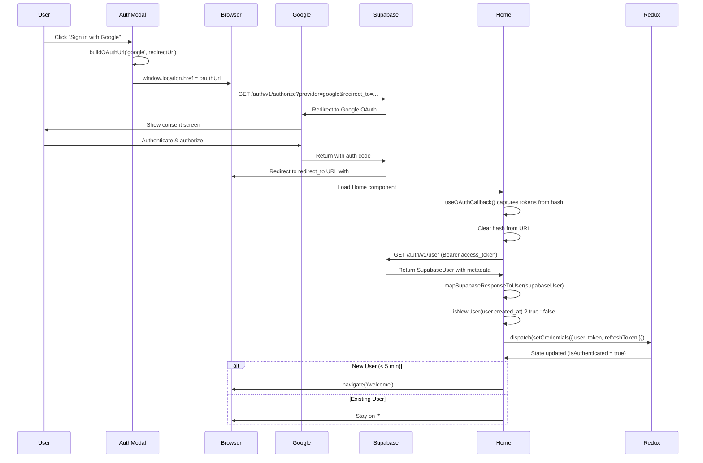

# OAuth Flow Documentation

## OAuth with Google Sign-In/Sign-Up Flow

Este documento describe el flujo completo de autenticación OAuth con Google implementado en WageVantage usando Supabase API (sin SDK) y RTK Query.

---

## 📋 Resumen del flujo

1. **Usuario hace click en botón "Google"** en AuthModal
2. **Redirección a Google** para autenticación
3. **Google autentica** al usuario
4. **Callback a nuestra app** con tokens en URL hash
5. **Captura de tokens** y obtención de datos del usuario
6. **Actualización de Redux** con credenciales
7. **Navegación** según tipo de usuario (nuevo → `/welcome`, existente → `/`)

---

## 🔄 Diagrama de secuencia



---

## 📂 Archivos involucrados

### Backend / Auth Layer

#### [`authApi.ts`](../../../src/features/auth/authApi.ts)

**Helpers:**

- `getSupabaseUrl()` — Lee `VITE_SUPABASE_URL` con fallback
- `buildOAuthUrl(provider, redirectTo)` — Construye URL de OAuth authorize
- `isNewUser(createdAt)` — Detecta usuarios nuevos (< 5 minutos)

**Mutations:**

- `getSessionFromTokens({ accessToken })` — GET `/auth/v1/user` para obtener datos del usuario

### Frontend / UI Layer

#### [`AuthModal.tsx`](../../../src/components/ui/modals/AuthModal.tsx)

**Función:**

- `handleGoogleSignIn()` — Construye URL OAuth y redirige con `window.location.href`

**Props:**

- `initialError?: string | null` — Muestra errores de OAuth callback

#### [`useOAuthCallback.ts`](../../../src/hooks/useOAuthCallback.ts)

**Hook personalizado** que:

- Lee `window.location.hash`
- Parsea tokens: `access_token`, `refresh_token`
- Parsea errores: `error`, `error_description`
- Limpia hash del URL con `window.history.replaceState`
- Retorna: `{ accessToken, refreshToken, error, errorDescription, isLoading }`

#### [`Home.tsx`](../../../src/pages/Home.tsx)

**Integración:**

- Usa `useOAuthCallback()` para capturar tokens
- Llama `getSessionFromTokens` mutation
- Mapea response con `mapSupabaseResponseToUser`
- Despacha `setCredentials` a Redux
- Detecta signup vs login con `isNewUser()`
- Redirige según tipo de usuario
- Maneja errores mostrando AuthModal con mensaje

---

## 🔐 Variables de entorno

### `.env`

```env
VITE_SUPABASE_URL=https://idrgqvtgllamddukkkvx.supabase.co
VITE_SUPABASE_API_KEY=sb_publishable_UBrc_...
```

---

## 🚀 Flujo detallado paso a paso

### 1. Inicio del flujo (Click en botón Google)

**Ubicación:** `AuthModal.tsx` línea ~108

```typescript
const handleGoogleSignIn = () => {
  const redirectUrl = `${window.location.origin}/`;
  const oauthUrl = buildOAuthUrl("google", redirectUrl);
  window.location.href = oauthUrl; // Redirige a Google
};
```

**URL generada:**

```
https://idrgqvtgllamddukkkvx.supabase.co/auth/v1/authorize
  ?provider=google
  &redirect_to=http://localhost:5173/
```

---

### 2. Redirección a Google y autenticación

- Supabase redirige a la pantalla de consentimiento de Google
- Usuario autentica con credenciales de Google
- Usuario autoriza acceso a su información básica
- Google devuelve código de autorización a Supabase

---

### 3. Callback con tokens en URL hash

Supabase redirige de vuelta a `redirect_to` con tokens en el hash:

```
http://localhost:5173/#access_token=eyJhbGci...&refresh_token=v1.MR5m...&expires_in=3600&token_type=bearer
```

**Si hay error:**

```
http://localhost:5173/#error=access_denied&error_description=User+cancelled+login
```

---

### 4. Captura de tokens (useOAuthCallback)

**Ubicación:** `useOAuthCallback.ts`

```typescript
export function useOAuthCallback() {
    // Lee hash
    const hash = window.location.hash.substring(1);
    const params = new URLSearchParams(hash);

    // Extrae tokens
    const token = params.get('access_token');
    const refresh = params.get('refresh_token');

    // Limpia URL
    window.history.replaceState(null, '', window.location.pathname);

    return { accessToken: token, refreshToken: refresh, ... };
}
```

---

### 5. Obtención de datos del usuario

**Ubicación:** `Home.tsx` línea ~53

```typescript
useEffect(() => {
    if (accessToken && refreshToken) {
        const processOAuthLogin = async () => {
            // GET /auth/v1/user con Bearer token
            const supabaseUser = await getSessionFromTokens({ accessToken }).unwrap();

            // Mapear a nuestro modelo
            const user = mapSupabaseResponseToUser(supabaseUser);

            // Despachar a Redux
            dispatch(setCredentials({ user, token: accessToken, refreshToken }));
        };
        processOAuthLogin();
    }
}, [accessToken, refreshToken, ...]);
```

**Request:**

```http
GET /auth/v1/user
Authorization: Bearer eyJhbGci...
apikey: sb_publishable_...
```

**Response:**

```json
{
  "id": "uuid",
  "email": "user@gmail.com",
  "user_metadata": {
    "name": "User Name",
    "premium": false,
    "templates": [],
    "comparisons": [],
    "payData": { "card": null, "history": [] }
  },
  "created_at": "2026-04-22T10:30:00Z",
  ...
}
```

---

### 6. Detección signup vs login

**Ubicación:** `Home.tsx` línea ~69

```typescript
if (supabaseUser.created_at && isNewUser(supabaseUser.created_at)) {
  // Nuevo usuario → redirigir a welcome
  navigate("/welcome", { replace: true });
}
// Usuario existente → mantener en Home (/)
```

**Helper `isNewUser`:**

```typescript
export const isNewUser = (createdAt: string): boolean => {
  const created = new Date(createdAt).getTime();
  const now = Date.now();
  const fiveMinutes = 5 * 60 * 1000;
  return now - created < fiveMinutes;
};
```

---

### 7. Actualización de Redux

```typescript
dispatch(
  setCredentials({
    user: {
      id: "uuid",
      email: "user@gmail.com",
      name: "User Name",
      premium: false,
      templates: [],
      comparisons: [],
      payData: { card: null, history: [] },
    },
    token: "eyJhbGci...",
    refreshToken: "v1.MR5m...",
  }),
);
```

**Estado actualizado:**

```javascript
{
    auth: {
        user: { ... },
        token: "eyJhbGci...",
        refreshToken: "v1.MR5m...",
        isAuthenticated: true
    }
}
```

---

## ⚠️ Manejo de errores

### Error en OAuth callback

**Casos:**

- Usuario cancela en pantalla de Google
- Error de configuración en Supabase
- Token inválido o expirado

**Flujo:**

1. `useOAuthCallback` detecta `error` en hash
2. Extrae `error_description`
3. Home muestra AuthModal con `initialError`
4. Usuario ve mensaje descriptivo en modal

**Código:**

```typescript
// En Home.tsx
if (oauthCallbackError) {
  setOauthError(errorDescription || "OAuth authentication failed");
  setAuthModalMode("login");
  setIsAuthModalOpen(true);
}

// AuthModal muestra displayError
const displayError = initialError || formError;
```

### Error al obtener datos del usuario

```typescript
catch (err) {
    console.error('OAuth login error:', err);
    setOauthError('Failed to complete OAuth login. Please try again.');
    setAuthModalMode('login');
    setIsAuthModalOpen(true);
}
```

---

## 🧪 Testing

### Manual testing checklist

- [ ] Click botón Google redirige a Google OAuth
- [ ] Autenticación exitosa redirige de vuelta con tokens
- [ ] Tokens se capturan del hash correctamente
- [ ] Hash se limpia del URL después de captura
- [ ] GET `/auth/v1/user` retorna datos correctos
- [ ] Redux se actualiza con `isAuthenticated: true`
- [ ] Nuevo usuario (< 5 min) redirige a `/welcome`
- [ ] Usuario existente permanece en `/`
- [ ] Cancelar en Google muestra error en AuthModal
- [ ] Tokens persisten después de refresh (redux-persist)
- [ ] No hay errores en console
- [ ] Network tab muestra requests correctos

### Edge cases

- Usuario cancela en pantalla de Google → Muestra error descriptivo
- Token inválido en callback → Captura error y muestra modal
- Usuario cierra modal de error → Error se limpia correctamente
- Múltiples clicks rápidos en botón → Disabled previene duplicados

---

## 🔒 Seguridad

### Configuración requerida en Supabase Dashboard

**Authentication → Providers → Google:**

- ✅ Enable Sign in with Google
- Client ID: Configurado desde Google Cloud Console
- Client Secret: Configurado desde Google Cloud Console

**Authentication → URL Configuration:**

- ✅ Site URL: `http://localhost:5173` (dev) / `https://yourdomain.com` (prod)
- ✅ Redirect URLs: `http://localhost:5173/**` (wildcard)

### OAuth 2.0 Configuration en Google Cloud

- OAuth client ID type: Web application
- Authorized JavaScript origins: `http://localhost:5173`
- Authorized redirect URIs: `https://idrgqvtgllamddukkkvx.supabase.co/auth/v1/callback`

---

## 📊 Persistencia

- **Redux Persist** configurado en `persistConfig.ts`
- Whitelist: `['auth']` — persiste todo el slice auth
- Storage: localStorage con adapter personalizado
- OAuth tokens persisten igual que email/password auth
- Usuario permanece autenticado después de refresh

---

## 🚧 Limitaciones actuales

- Solo Google OAuth implementado (GitHub pendiente)
- No hay manejo de refresh token automático (implementar en futuro)
- No hay logout desde Google (solo local)

---

## 📝 Notas adicionales

### ¿Por qué GET `/auth/v1/user` en vez de `/auth/v1/token`?

- El callback de OAuth ya incluye `access_token` y `refresh_token` en el hash
- No necesitamos intercambiar código por tokens (Supabase ya lo hizo)
- Solo necesitamos obtener `user_metadata` completo usando el `access_token`

### ¿Por qué mutation en vez de query?

- RTK Query recomienda mutations para requests que NO se deben cachear
- Cada llamada a `/auth/v1/user` debe ser fresca (evita datos obsoletos)
- No tiene sentido cachear datos de autenticación por URL params

### ¿Por qué detectar signup en cliente?

- Supabase no diferencia signup vs login en OAuth response
- `created_at < 5 min` es heurística confiable para detectar nuevos usuarios
- Permite redirigir a `/welcome` solo para nuevos usuarios
