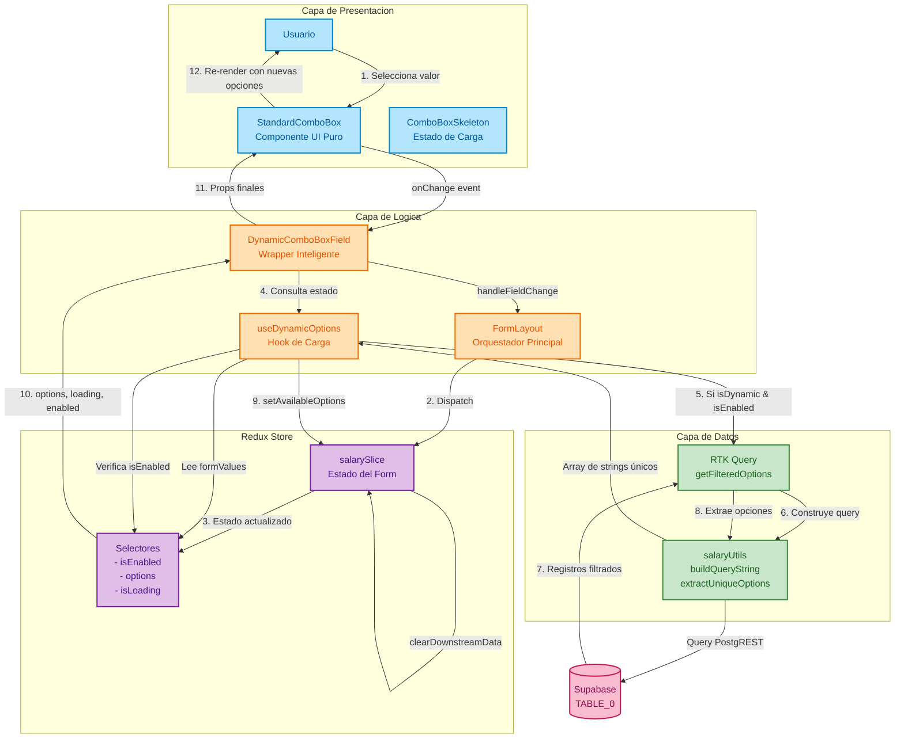
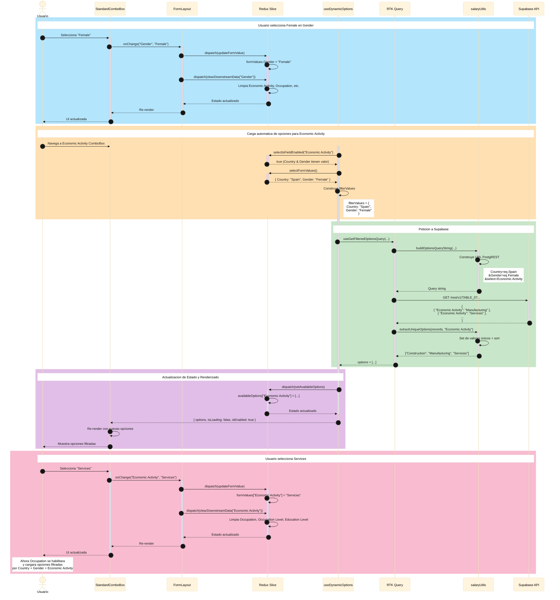
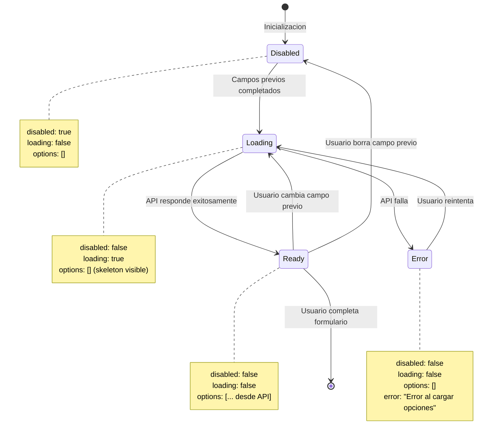
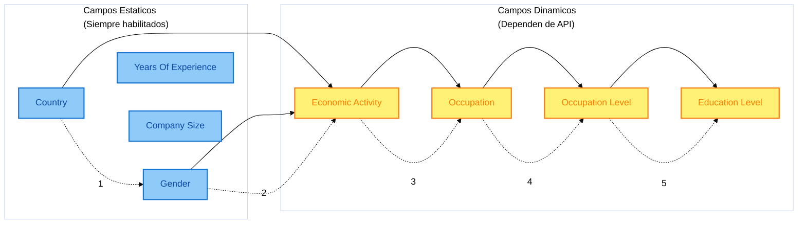
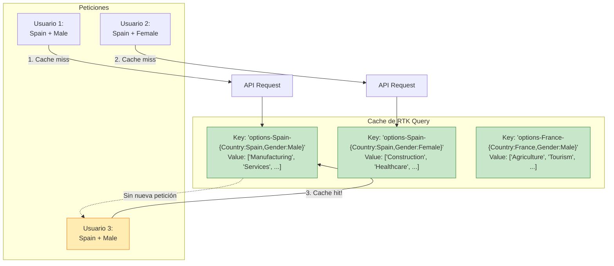

# Arquitectura de StandardComboBox y Opciones Dinámicas

## 1. Diagrama de Arquitectura y Flujo de Datos

Este diagrama muestra la arquitectura completa del sistema de ComboBox dinámicos y cómo fluyen los datos desde la interacción del usuario hasta la API de Supabase.

---

## 2. Diagrama de Secuencia: Selección de Economic Activity

Este diagrama muestra la secuencia temporal de eventos cuando un usuario selecciona un valor en un campo que afecta a campos dependientes.

---

## 3. Diagrama de Estados: Ciclo de Vida de un Campo Dinámico

---

## 4. Diagrama de Dependencias entre Campos

---

## 5. Diagrama de Cache: RTK Query

---

## Resumen de Responsabilidades

| Componente               | Responsabilidad                   | Input                                       | Output                              |
| ------------------------ | --------------------------------- | ------------------------------------------- | ----------------------------------- |
| **StandardComboBox**     | Renderizar UI del ComboBox        | `options[]`, `value`, `disabled`, `loading` | Eventos `onChange`                  |
| **DynamicComboBoxField** | Decidir origen de opciones        | `field`, `value`                            | Props para `StandardComboBox`       |
| **useDynamicOptions**    | Orquestar carga de opciones       | `fieldId`                                   | `{ options, isLoading, isEnabled }` |
| **RTK Query**            | Gestionar peticiones HTTP         | `country`, `formValues`, `targetFields`     | `SalaryRecord[]` con cache          |
| **salaryUtils**          | Construir queries y extraer datos | `formValues`, `records`                     | Query strings y arrays únicos       |
| **Redux Selectors**      | Calcular estado derivado          | State completo                              | Estados booleanos y arrays          |

---

## Notas de Implementación

### ✅ Ventajas del Diseño

1. **Separación de responsabilidades**: Cada capa tiene un propósito único
2. **Testabilidad**: Componentes puros fáciles de probar
3. **Rendimiento**: Cache automático de RTK Query + memoización de selectores
4. **Escalabilidad**: Añadir nuevos campos dinámicos es trivial

### ⚠️ Consideraciones

1. **Country es obligatorio**: Sin Country, ningún campo dinámico puede cargar opciones
2. **Limpieza en cascada**: Cambiar un campo limpia todos los campos posteriores
3. **Query progresiva**: Solo se incluyen filtros con valor en la URL
4. **Truncamiento de valores**: Occupation/Education Level se truncan a 19 chars para evitar URLs demasiado largas
