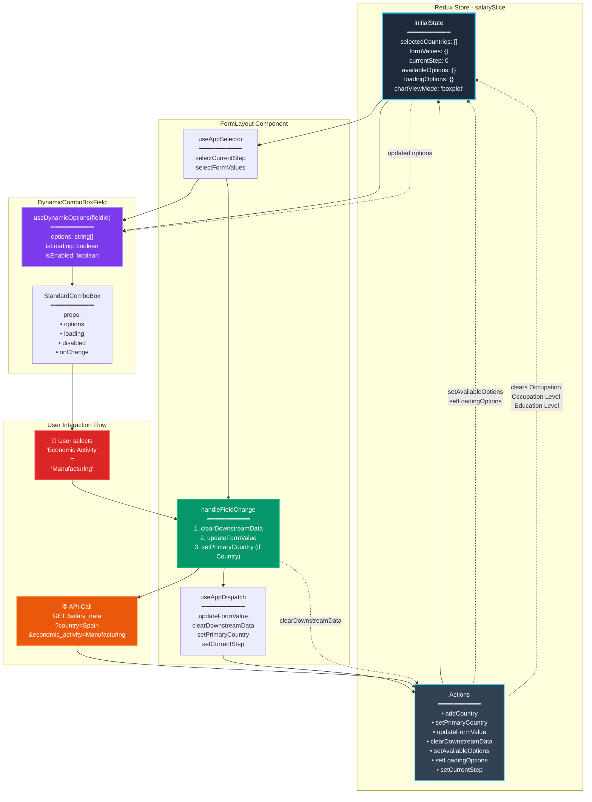

```mermaid
graph TB
    subgraph "Redux Store - salarySlice"
        State["initialState<br/>━━━━━━━━━━━<br/>selectedCountries: []<br/>formValues: {}<br/>currentStep: 0<br/>availableOptions: {}<br/>loadingOptions: {}<br/>chartViewMode: 'boxplot'"]

        Actions["Actions<br/>━━━━━━━━━━━<br/>• addCountry<br/>• setPrimaryCountry<br/>• updateFormValue<br/>• clearDownstreamData<br/>• setAvailableOptions<br/>• setLoadingOptions<br/>• setCurrentStep"]
    end

    subgraph "FormLayout Component"
        FL_Read["useAppSelector<br/>━━━━━━━━━━━<br/>selectCurrentStep<br/>selectFormValues"]
        FL_Dispatch["useAppDispatch<br/>━━━━━━━━━━━<br/>updateFormValue<br/>clearDownstreamData<br/>setPrimaryCountry<br/>setCurrentStep"]
        FL_Handler["handleFieldChange<br/>━━━━━━━━━━━<br/>1. clearDownstreamData<br/>2. updateFormValue<br/>3. setPrimaryCountry (if Country)"]
    end

    subgraph "DynamicComboBoxField"
        DCF_Hook["useDynamicOptions(fieldId)<br/>━━━━━━━━━━━<br/>options: string[]<br/>isLoading: boolean<br/>isEnabled: boolean"]
        DCF_Component["StandardComboBox<br/>━━━━━━━━━━━<br/>props:<br/>• options<br/>• loading<br/>• disabled<br/>• onChange"]
    end

    subgraph "User Interaction Flow"
        User["👤 User selects<br/>'Economic Activity'<br/>=<br/>'Manufacturing'"]
        API["🌐 API Call<br/>GET /salary_data<br/>?country=Spain<br/>&economic_activity=Manufacturing"]
    end

    %% Connections
    State --> FL_Read
    FL_Read --> FL_Handler
    FL_Handler --> FL_Dispatch
    FL_Dispatch --> Actions
    Actions --> State

    FL_Read --> DCF_Hook
    State --> DCF_Hook
    DCF_Hook --> DCF_Component
    DCF_Component --> User
    User --> FL_Handler

    FL_Handler --> API
    API --> Actions
    Actions -.->|setAvailableOptions<br/>setLoadingOptions| State
    State -.->|updated options| DCF_Hook

    %% Cascade effect
    FL_Handler -.->|clearDownstreamData| Actions
    Actions -.->|clears Occupation,<br/>Occupation Level,<br/>Education Level| State

    style State fill:#1e293b,stroke:#45d2fd,stroke-width:3px,color:#fff
    style Actions fill:#334155,stroke:#45d2fd,stroke-width:2px,color:#fff
    style FL_Handler fill:#059669,stroke:#10b981,stroke-width:2px,color:#fff
    style DCF_Hook fill:#7c3aed,stroke:#a78bfa,stroke-width:2px,color:#fff
    style User fill:#dc2626,stroke:#f87171,stroke-width:2px,color:#fff
    style API fill:#ea580c,stroke:#fb923c,stroke-width:2px,color:#fff
```
