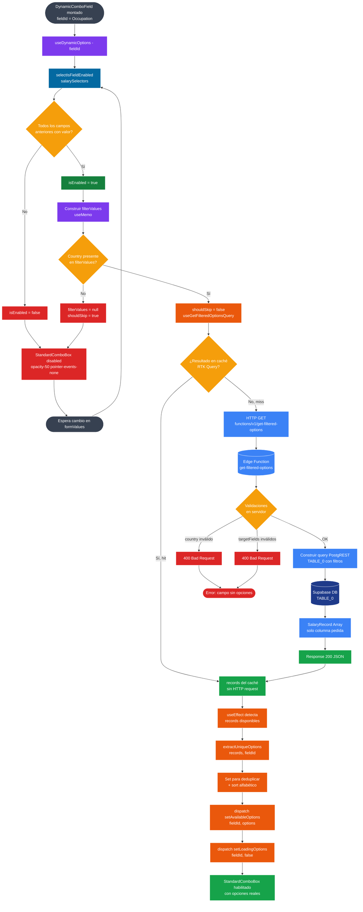
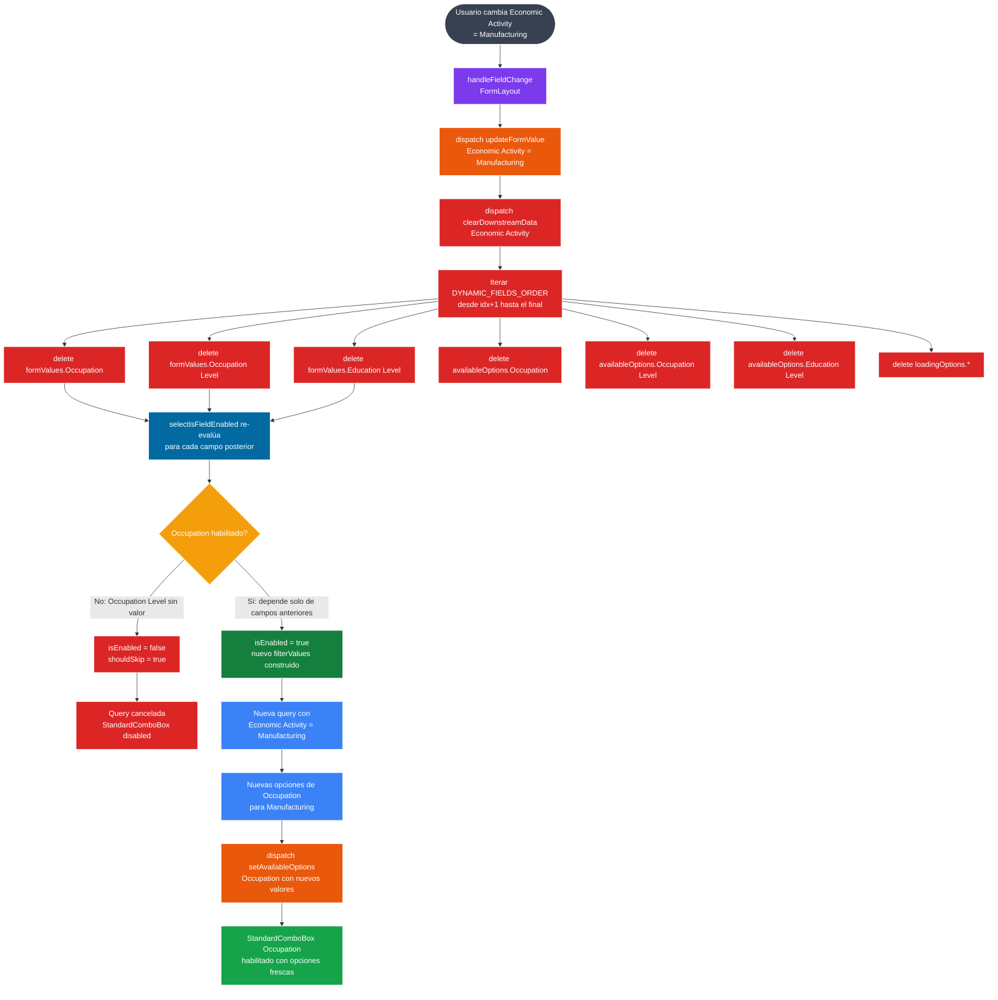
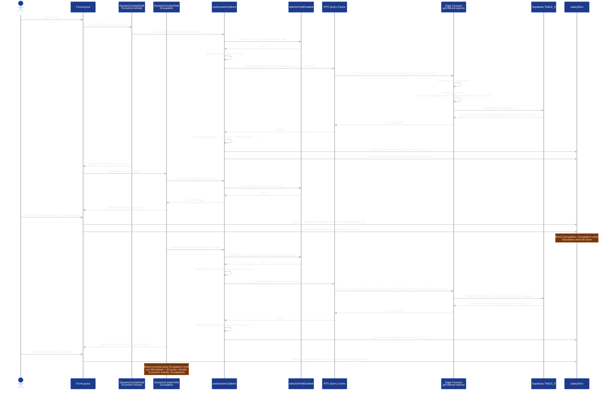
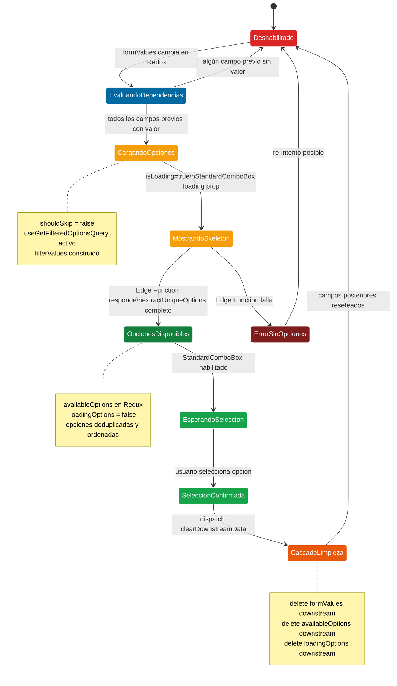
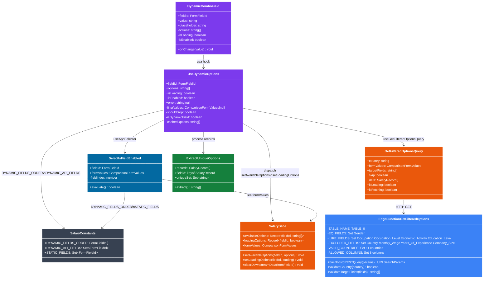
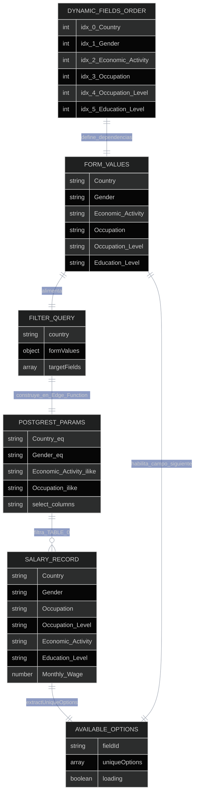
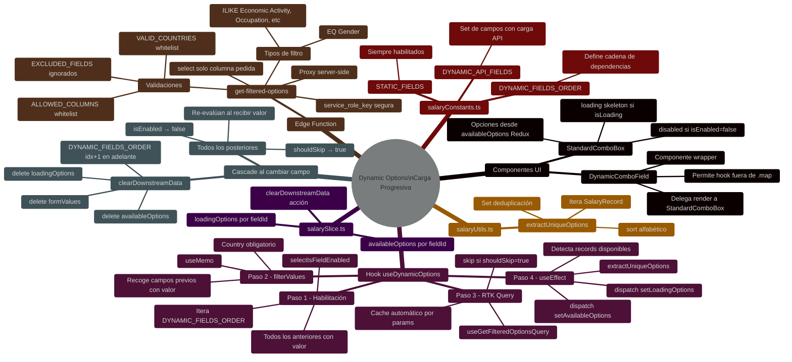

# Dynamic Options — Carga Progresiva de ComboBox

## Diagrama de Flujo — Lógica completa de useDynamicOptions

## Diagrama de Flujo — Cascade al cambiar un campo

## Diagrama de Secuencia — Carga progresiva completa Step 2

## Diagrama de Estados — Ciclo de vida de un campo dinámico

## Diagrama de Clases — Arquitectura de carga dinámica

## Diagrama ER — Relación entre filtros y opciones generadas

## Mapa Mental — Sistema completo de opciones dinámicas

