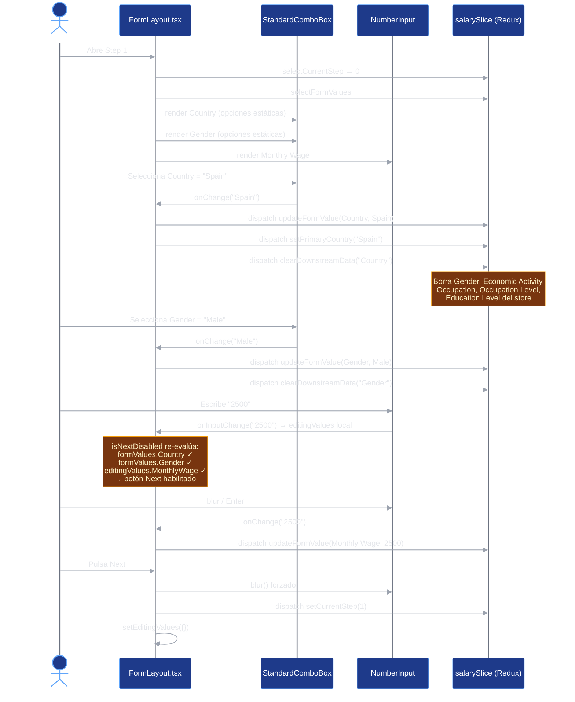
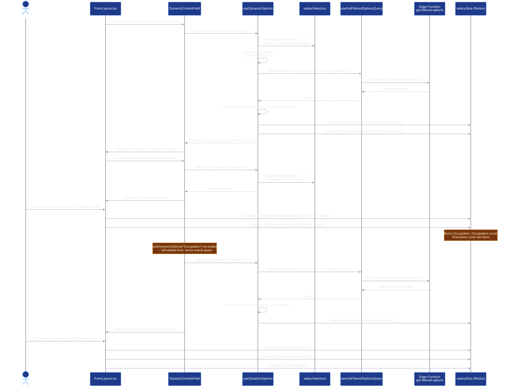
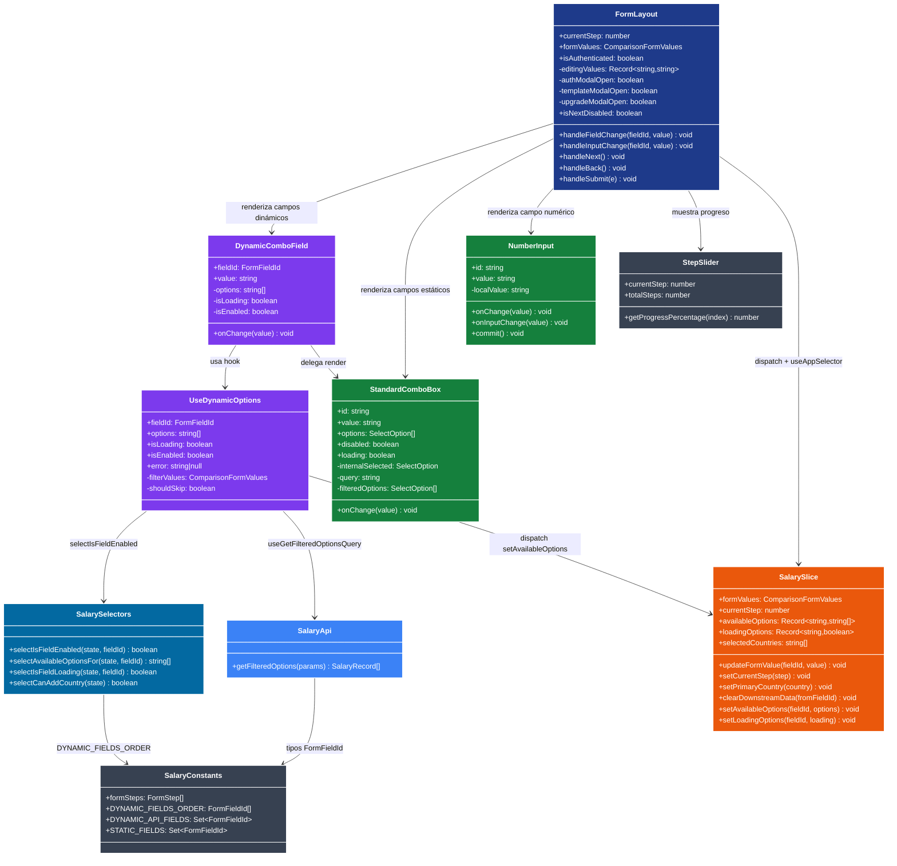
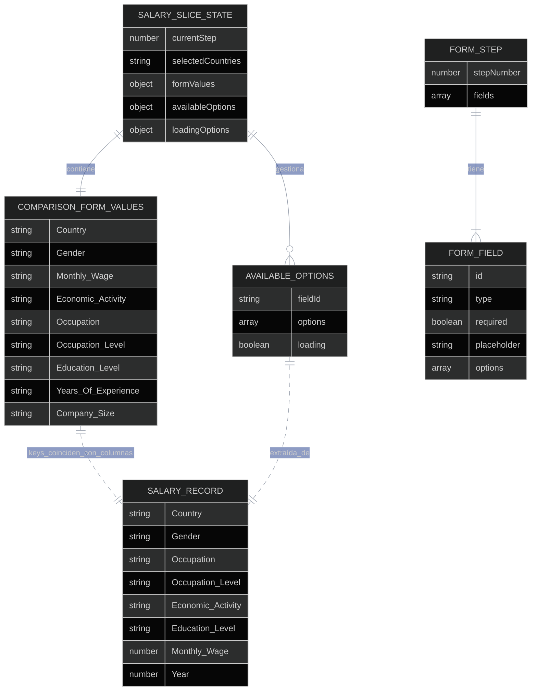

# Form Wizard Flow (Step 1 → 3) — Diagramas

## Diagrama de Flujo

```mermaid
graph TD
    A([Usuario llega al FormLayout]) --> B[StepSlider muestra progreso\ncurrentStep desde Redux]
    B --> C{currentStep}

    C -- 0 --> D[Step 1: Country · Gender · Monthly Wage]
    C -- 1 --> E[Step 2: Economic Activity · Occupation · Occupation Level]
    C -- 2 --> F[Step 3: Education Level · Years of Experience · Company Size]

    D --> G{field.type}
    G -- select con options estáticas --> H[StandardComboBox\nopciones hardcodeadas]
    G -- number --> I[NumberInput\ncommit diferido en blur/Enter]

    H --> J[handleFieldChange - fieldId · value]
    I --> K{¿commit o keystroke?}
    K -- keystroke --> L[onInputChange → editingValues local]
    K -- blur / Enter --> J

    J --> M[dispatch updateFormValue]
    M --> N{fieldId === Country?}
    N -- Sí --> O[dispatch setPrimaryCountry\n+ dispatch clearDownstreamData]
    N -- No --> P[valor guardado en formValues]
    O --> P

    P --> Q{isNextDisabled?}
    Q -- algún required vacío --> R[Botón Next deshabilitado]
    Q -- todos completos --> S[Botón Next habilitado]

    S --> T[Usuario pulsa Next]
    T --> U[handleNext: blur NumberInput\n+ dispatch setCurrentStep +1\n+ setEditingValues vacío]
    U --> E

    E --> V{field.options.length === 0?}
    V -- Sí --> W[DynamicComboField\nuseDynamicOptions fieldId]
    V -- No --> H

    W --> X{isEnabled?\nselectIsFieldEnabled}
    X -- No --> Y[StandardComboBox disabled\n+ skeleton si loading]
    X -- Sí --> Z[useGetFilteredOptionsQuery\n→ Edge Function get-filtered-options]

    Z --> AA[SalaryRecord Array]
    AA --> AB[extractUniqueOptions\nopciones únicas ordenadas]
    AB --> AC[dispatch setAvailableOptions\ndispatch setLoadingOptions false]
    AC --> AD[StandardComboBox con opciones reales]

    AD --> AE[Usuario selecciona opción]
    AE --> AF[handleFieldChange]
    AF --> AG[dispatch updateFormValue\n+ dispatch clearDownstreamData]
    AG --> AH{Campos posteriores\nlimpios → se re-evalúan]

    F --> AI{isLastStep}
    AI -- Sí --> AJ[Mostrar botón Save as template]
    AJ --> AK{isAuthenticated?}
    AK -- No --> AL[AuthModal login]
    AK -- Sí --> AM{canSaveTemplate?}
    AM -- No --> AN[UpgradeModal]
    AM -- Sí --> AO[TemplateModal save]

    AI -- Sí --> AP[Botón submit Go to comparison sheet]
    AP --> AQ[handleSubmit → onNavigateToSheet]

    style A fill:#374151,stroke:#fff,color:#fff
    style D fill:#1e3a8a,stroke:#fff,color:#fff
    style E fill:#1e3a8a,stroke:#fff,color:#fff
    style F fill:#1e3a8a,stroke:#fff,color:#fff
    style H fill:#15803d,stroke:#fff,color:#fff
    style I fill:#15803d,stroke:#fff,color:#fff
    style J fill:#ea580c,stroke:#fff,color:#fff
    style M fill:#ea580c,stroke:#fff,color:#fff
    style O fill:#dc2626,stroke:#fff,color:#fff
    style P fill:#ea580c,stroke:#fff,color:#fff
    style R fill:#dc2626,stroke:#fff,color:#fff
    style S fill:#16a34a,stroke:#fff,color:#fff
    style T fill:#374151,stroke:#fff,color:#fff
    style U fill:#ea580c,stroke:#fff,color:#fff
    style W fill:#7c3aed,stroke:#fff,color:#fff
    style X fill:#f59e0b,stroke:#fff,color:#fff
    style Y fill:#dc2626,stroke:#fff,color:#fff
    style Z fill:#3b82f6,stroke:#fff,color:#fff
    style AA fill:#3b82f6,stroke:#fff,color:#fff
    style AB fill:#0369a1,stroke:#fff,color:#fff
    style AC fill:#ea580c,stroke:#fff,color:#fff
    style AD fill:#15803d,stroke:#fff,color:#fff
    style AG fill:#dc2626,stroke:#fff,color:#fff
    style AL fill:#dc2626,stroke:#fff,color:#fff
    style AN fill:#dc2626,stroke:#fff,color:#fff
    style AO fill:#16a34a,stroke:#fff,color:#fff
    style AQ fill:#16a34a,stroke:#fff,color:#fff
```

## Diagrama de Secuencia — Step 1 (campos estáticos)



## Diagrama de Secuencia — Step 2 (campos dinámicos)



## Diagrama de Estados — Habilitación de Campos

```mermaid
stateDiagram-v2
    [*] --> Step1Activo

    Step1Activo --> CountryVacio: render
    CountryVacio --> CountrySeleccionado: usuario selecciona país
    CountrySeleccionado --> CascadeLimpiada: clearDownstreamData Country

    CascadeLimpiada --> GenderVacio
    GenderVacio --> GenderSeleccionado: usuario selecciona género
    GenderSeleccionado --> SalarioEnEdicion: usuario escribe salario

    SalarioEnEdicion --> SalarioCommiteado: blur o Enter
    SalarioCommiteado --> Step1Completo: todos los required con valor

    Step1Completo --> Step2Activo: usuario pulsa Next

    Step2Activo --> EconomicActivityCargando: useDynamicOptions lanza query
    EconomicActivityCargando --> EconomicActivityListo: Edge Function responde
    EconomicActivityListo --> EconomicActivitySeleccionado: usuario selecciona

    EconomicActivitySeleccionado --> OccupationHabilitado: clearDownstreamData
    OccupationHabilitado --> OccupationCargando: nueva query con filtros
    OccupationCargando --> OccupationListo: Edge Function responde
    OccupationListo --> OccupationSeleccionado: usuario selecciona

    OccupationSeleccionado --> OccupationLevelHabilitado
    OccupationLevelHabilitado --> OccupationLevelSeleccionado: usuario selecciona
    OccupationLevelSeleccionado --> Step2Completo

    Step2Completo --> Step3Activo: usuario pulsa Next

    Step3Activo --> EducationLevelCargando: useDynamicOptions lanza query
    EducationLevelCargando --> EducationLevelListo: Edge Function responde
    EducationLevelListo --> EducationLevelSeleccionado: usuario selecciona

    EducationLevelSeleccionado --> CamposEstaticosStep3
    CamposEstaticosStep3 --> Step3Completo: Years + Company Size seleccionados

    Step3Completo --> ResultadoFinal: Go to comparison sheet

    classDef activeStep fill:#1e3a8a,stroke:#fff,color:#fff
    classDef emptyField fill:#374151,stroke:#fff,color:#fff
    classDef loadingField fill:#f59e0b,stroke:#fff,color:#fff
    classDef readyField fill:#15803d,stroke:#fff,color:#fff
    classDef selectedField fill:#16a34a,stroke:#fff,color:#fff
    classDef cascade fill:#dc2626,stroke:#fff,color:#fff
    classDef complete fill:#ea580c,stroke:#fff,color:#fff
    classDef final fill:#7c3aed,stroke:#fff,color:#fff

    class Step1Activo,Step2Activo,Step3Activo activeStep
    class CountryVacio,GenderVacio,SalarioEnEdicion emptyField
    class EconomicActivityCargando,OccupationCargando,EducationLevelCargando loadingField
    class EconomicActivityListo,OccupationListo,EducationLevelListo readyField
    class CountrySeleccionado,GenderSeleccionado,SalarioCommiteado,EconomicActivitySeleccionado,OccupationSeleccionado,OccupationLevelSeleccionado,EducationLevelSeleccionado,CamposEstaticosStep3 selectedField
    class CascadeLimpiada cascade
    class Step1Completo,Step2Completo,Step3Completo complete
    class ResultadoFinal final
```



## Diagrama de Clases



## Diagrama de Entidad-Relación — Estructura de datos del wizard



## Mapa Mental

```mermaid
%%{init: {'theme':'dark', 'themeVariables': {
  'primaryColor':'#1e3a8a',
  'primaryTextColor':'#ffffff',
  'primaryBorderColor':'#60a5fa',
  'lineColor':'#6b7280'
}}}%%
mindmap
  root((Form Wizard\nStep 1→3))
    FormLayout.tsx
      Estado local
        editingValues
        authModalOpen
        templateModalOpen
        upgradeModalOpen
      Navegación
        handleNext
        handleBack
        handleSubmit
      Validación
        isNextDisabled
        required fields check
        formValues + editingValues
    Step 1 - Estático
      Country
        StandardComboBox
        setPrimaryCountry
        clearDownstreamData
      Gender
        StandardComboBox
        clearDownstreamData
      Monthly Wage
        NumberInput
        commit diferido blur/Enter
        onInputChange tiempo real
    Step 2 - Dinámico
      DynamicComboField
        useDynamicOptions
          selectIsFieldEnabled
          filterValues construction
          useGetFilteredOptionsQuery
          extractUniqueOptions
          setAvailableOptions
          setLoadingOptions
      Economic Activity
        depende de Country + Gender
      Occupation
        depende de + Economic Activity
      Occupation Level
        depende de + Occupation
    Step 3 - Mixto
      Education Level
        dinámico
        depende de todos los anteriores
      Years Of Experience
        estático hardcodeado
      Company Size
        estático hardcodeado
      Save as template
        usePlanLimits
        TemplateModal
        UpgradeModal
    Redux - salarySlice
      updateFormValue
      clearDownstreamData
        cascade cleanup
        formValues
        availableOptions
        loadingOptions
      setCurrentStep
      setAvailableOptions
      setLoadingOptions
    API - Edge Functions
      get-filtered-options
        query PostgREST
        filtra TABLE_0
        retorna SalaryRecord[]
      salaryApi RTK Query
        cache por filtros
        skip si deshabilitado
    salaryConstants.ts
      formSteps array
      DYNAMIC_FIELDS_ORDER
      DYNAMIC_API_FIELDS
      STATIC_FIELDS
```
