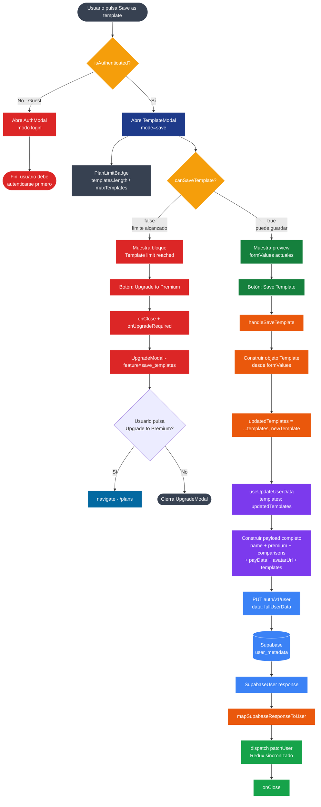
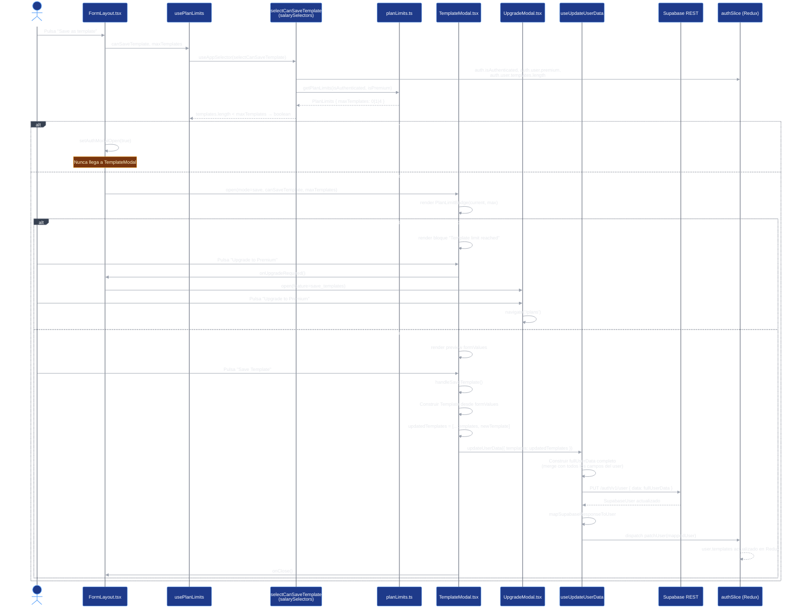
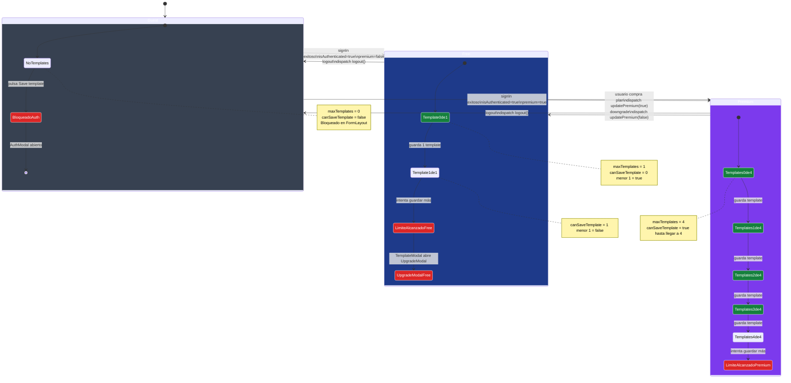
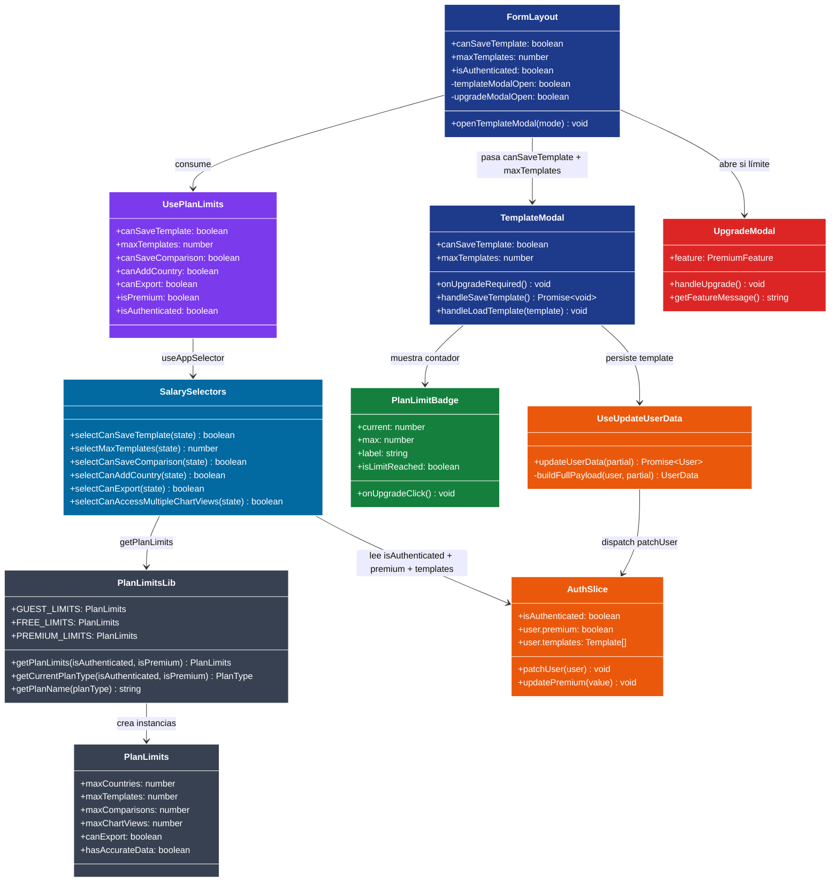
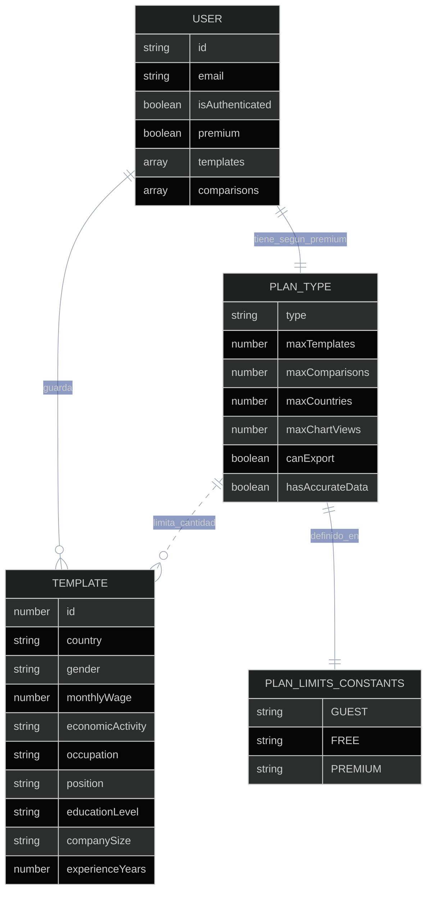
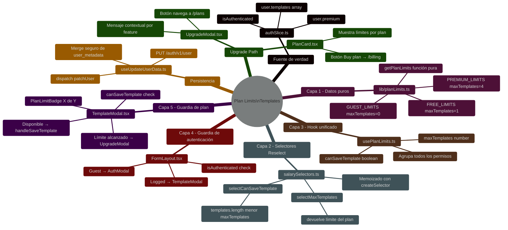

# Plan Limits & Feature Access — Diagramas

## Diagrama de Flujo — Guardar Template (foco en control de plan)

## Diagrama de Secuencia — Templates según plan

## Diagrama de Estados — Usuario según plan y acceso a templates

## Diagrama de Clases — Capas del sistema de planes

## Diagrama de Entidad-Relación — Estructura de planes y templates

## Mapa Mental — Sistema de planes y templates

